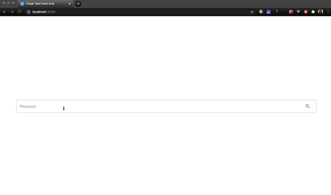

<h1 align="center">Teste Front-End iCasei</h1>

## Sobre o Projeto

Teste para a vaga de Desenvolvedor Front-End na iCasei. Aplicação desenvolvida em ReactJS, utilizando styled components e hooks .  Para rodar a aplicação localmente basta efetuar o clone ou download. Acessar a pasta raiz do projeto e digitar:

```
npm install

```
e depois:

```
npm start

```

Você também pode acessar uma versão funcional hospedada no Firebase, no seguinte link - [iCasei Frontend](https://icasei-frontend-294815.web.app/)

## 🖥 Preview

<p align="center">
  
</p>


## 💻 Projeto
## Especificações funcionais
### Tela Inicial
Essa tela terá um formulário de busca posicionado no meio da tela com campo de texto com placeholder "Pesquisar" e um botão "Buscar". Esse formulário deverá ter validação.

Essa busca deverá chamar a url https://www.googleapis.com/youtube/v3/search?part=id,snippet&q={termo_de_busca}&key={API_KEY}

Ao fazer a busca, o formulário deve ser movido para o topo da tela usando css animate e mostrar a lista de resultados com os campos título, descrição, thumbnail e um link para a página de detalhes.

Essa página deverá ter paginação, utilizando os [recursos de paginação da api](https://developers.google.com/youtube/v3/guides/implementation/pagination?hl=pt-br).

### Tela de detalhes
A partir do videoId retornado na outra chamada, deve ser feito uma chamada para https://www.googleapis.com/youtube/v3/videos?id={VIDEO_ID}&part=snippet,statistics&key={API_KEY}

A partir desse retorno, deve-se montar uma tela contendo embed do video, título, like, deslike, descrição e visualizações.

Essa tela deve ter um botão para voltar, exibindo os últimos resultados da busca com a pagina em questão ativa.

 ---
<h4 align="center">
   Code and coffee ☕
</h4>

